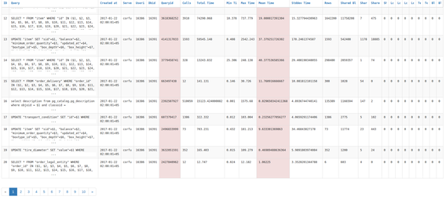

# yii2-pg-stat-statements
Yii2 component for tracking execution statistics and aggregation of all SQL 
statements executed by multiple servers.



## Features

* Multiple servers
* Execution statistics history
* Human interface

## Install

Via Composer

``` bash
$ composer require sima-land/yii2-pg-stat-statements
```

## Testing

```bash
$ composer test
```

## Security

If you discover any security related issues, please email pastukhov_k@sima-land.ru instead of using the issue tracker.

## Credits

- [All Contributors](../../contributors)

## License

MIT. Please see [License File](LICENSE) for more information.
